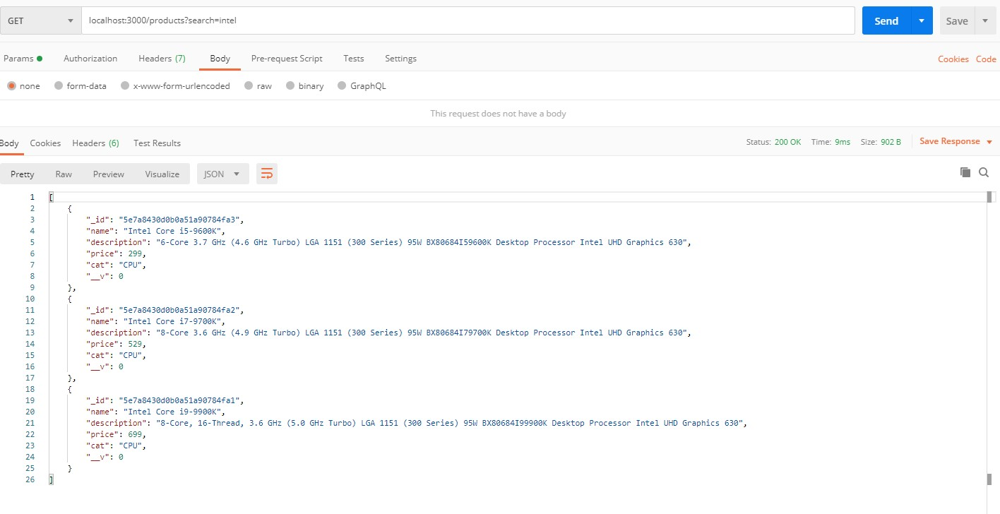
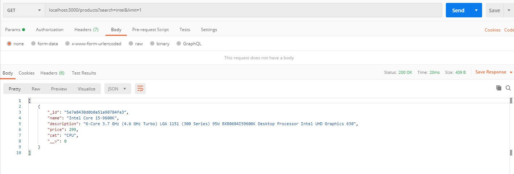
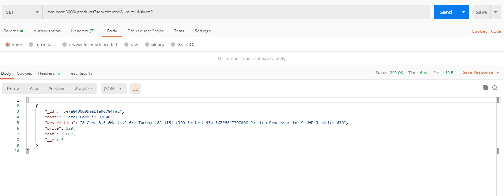

# Final Exam Research

## Pagination
Mongoose's limit() and skip() methods make pagination quite easy, I decided to pass in limit and page via url query, while giving backup default values.

```javascript
app.get('/products', (req, res) => {

    const limit = parseInt(req.query.limit) || 3;       // this is the number of products per page
    const skip = parseInt(req.query.skip) || 1;         // this is the current page

    Product.find()
        .limit(limit)
        .skip(skip)
        .then(products => res.status(200).send(products))
        .catch(err => res.status(500).send(err));
});
```

## Searching
I also decided to use a url query as my search term. mongodb has a very handy text index which can be used for searching through collections. This text index will remove all generic words like 'and', 'or' and 'the' and include all non generic words when doing a search using the $text and $search operators. Therefore I created a compound text index which includes the name, description and cat fields, allowing me to search all 3 fields in a single query.

To add a text index, this must be entered into the mongo shell (or client, I use robo3T)


When adding search functionality, the above route function changed to this:
`db.getCollection('products').createIndex({ name: "text", description: "text", cat: "text" })`

```javascript
app.get('/products', (req, res) => {

    const limit = parseInt(req.query.limit) || 3;       // this is the number of products per page
    const skip = parseInt(req.query.skip) || 1;         // this is the current page
    const search = req.query.search;

    // if search query exists, run this
    if (search) {
        return Product.find({
            // specify we are searching a text index
            $text: {
                $search: search     // the search term
            }
        })
            .limit(limit)
            .skip(skip)
            .then(products => res.status(200).send(products))
            .catch(err => res.status(500).send(err));
    }

    Product.find()
        .limit(limit)
        .skip(skip)
        .then(products => res.status(200).send(products))
        .catch(err => res.status(500).send(err));
});
```

### Using the search query


### Using limit query


### Using the skip query



#### Sources
https://docs.mongodb.com/manual/core/index-text/
https://docs.mongodb.com/manual/reference/method/cursor.skip/